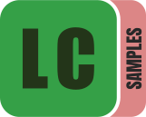

  
  
  Samples

---

  <h3>If you like this project, please consider giving it a star ⭐️!</h3>

## 📝 Description

The LectureCut Samples contains a set of sample videos files specifically designed to be used for testing and development purposes.

## 📜 License

All sample videos are licensed under the [MIT License](LICENSE).

## 🤝 Contributing

If you want to add a new sample video, please create a pull request with the new video file and a brief description of the video. The video should be in the public domain, have a license that allows redistribution, or be your own creation.

Note: All videos should be stored using the [Git LFS](https://git-lfs.github.com/) extension.